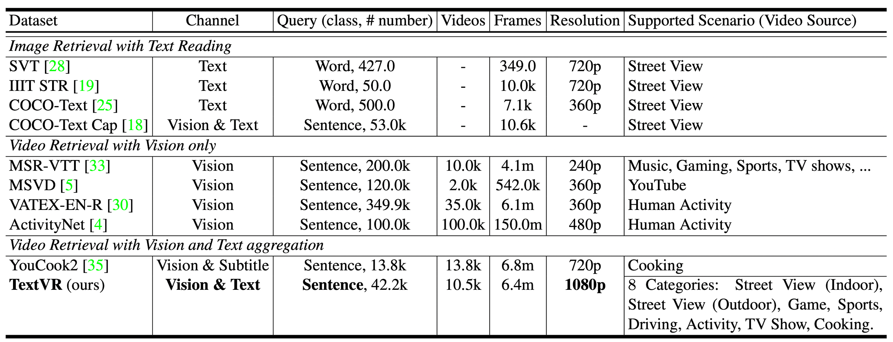
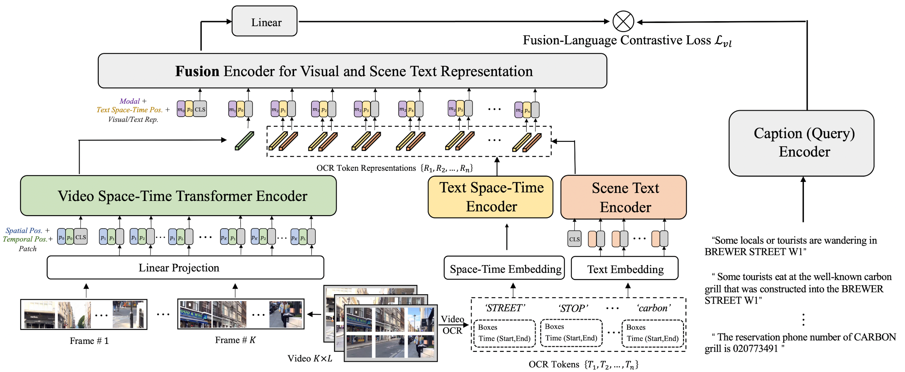

# TextVR: A Large Cross-Modal Video Retrieval Dataset with Reading Comprehension
 
## Abstract
Most existing cross-modal language-to-video retrieval (VR) research focuses on single-modal input from video, i.e., visual representation, while text is omnipresent in human environments and frequently critical to understand video. To study how to retrieve video with both modal inputs, i.e., visual and text semantic representations, we firstly introduce a large-scale and cross-modal Video Retrieval dataset with text reading comprehension, TextVR, which contains 42.2k sentence queries for 10.5k videos of 8 scenario domains, i.e., Street View (indoor), Street View (outdoor), Game, Sports, Driving, Activity, TV Show, and Cooking. The proposed TextVR requires one unified cross-modal model to recognize and comprehend texts, relate them to the visual context, and decide what text semantic information is vital for the video retrieval task.

## TextVR dataset

<p align="center" width="100%">

</p>

<p align="center" width="100%">

</p>

## TextVR model

<p align="center" width="100%">

</p>

## Get Started
 ### Environment Setup
The baseline model of TextVR is based on the video retrieval model [frozen-in-time](https://github.com/m-bain/frozen-in-time). To setup the environment of TextVR, we use `conda` to manage our dependencies. Our developers use `CUDA 11.1` to do experiments. You can specify the appropriate `cudatoolkit` version to install on your machine in the `requirements.txt` file, and then run the following commands to install FlowText:
 ```
conda create -n textvr python=3.8
conda activate textvr

pip install torch==1.9.0+cu111 torchvision==0.10.0+cu111 torchaudio==0.9.0 -f https://download.pytorch.org/whl/torch_stable.html

git clone https://github.com/callsys/TextVR
cd TextVR
pip install -r requirements.txt
 ```
### Download Dataset and Model
To run TextVR, you need to download some files, which mainly contain the [resized videos and annotation files](https://drive.google.com/file/d/1RZefU1XqODCt2NH68P0V_DMAOiQjRlSn/view?usp=share_link)(5.4G), the original videos(85G, [google drive](https://drive.google.com/drive/folders/1-ibNInaQusVEckCtKdUWGQjnr7DT4-E9?usp=sharing), [baidu drive](https://pan.baidu.com/s/1b9n19AvSsfFmhXgAsajo9Q), nenm) and the [trained model](https://drive.google.com/file/d/1RAzvMDpBUol_VQnZ0RHMrv_1pnrIBWD5/view?usp=sharing)(2.1G). Once you have downloaded the files, link them to the TextVR directory:
```
ln -s path/to/TextVR_data TextVR/data/TextVR
ln -s path/to/TextVR_ckpt TextVR/ckpt
```
The format of the download files are as follows:
```
TextVR
|
└─── data
|    |   
|    └─── TextVR
|         └─── TextVR_train.json
|         └─── TextVR_test_rand.json
|         └─── Videos
|         |    └─── Activaty
|         |    └─── Cooking
|         |    └─── ......
|         |    └─── Technology
|         |  
|         └─── Kwai_VideoOCR
|              └─── Activaty
|              └─── Cooking
|              └─── ......
|              └─── Technology
|         
└─── ckpt
     └─── config.json
     └─── textvr.pth
```
where `Kwai_VideoOCR` are the text in the video spotted by the Kuaishou OCR api.
### Running TextVR
Training TextVR with given config file `configs/TextVR_fusion.json`:
```
python train.py -c configs/TextVR_fusion.json
```
Inference TextVR with given weights `ckpt/textvr.pth` and save the similarity matrix `sim_matrix.npy`:
```
python test.py -c configs/TextVR_fusion.json -r ckpt/textvr.pth --sim_path sim_matrix.npy
```
`sim_matrix.npy` is a ndarray S of shape 2727 x 2727 (2727 is the size of the test set), where S(x, y) denotes the similarity score between the x-th caption and the y-th video. Here is an example of [`sim_matrix.npy`](https://drive.google.com/file/d/1pYZRYTqTE6tot-_F02Tcs89E9NtdUlx0/view?usp=share_link), its format should look like this:
```
S(1,1),S(1,2),...,S(1,2727)
S(2,1),S(2,2),...,S(2,2727)
...........................
S(2726,1),....,S(2726,2727)
S(2727,1),....,S[2727,2727)
```

### Validation 
Note that the caption of the test set has been scrambled so that the model cannot be validated offline. If you want to verify a model's performance on the test set, submit the similarity matrix `sim_matrix.npy` to the [competition website](https://codalab.lisn.upsaclay.fr/competitions/13317).

## Organization

## Acknowledgement
Code is largely based on [frozen-in-time](https://github.com/m-bain/frozen-in-time).

Work is fully supported by [MMU of Kuaishou Technology](https://www.kuaishou.com/en).
